# Spring Angular Digital Banking Project

## Interface

### Main
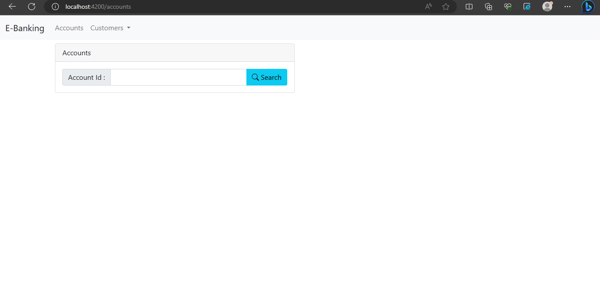

### Add Client
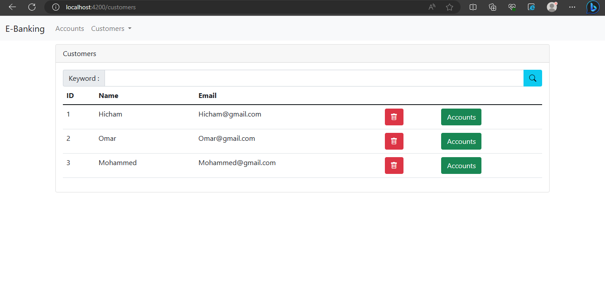

### Find Client
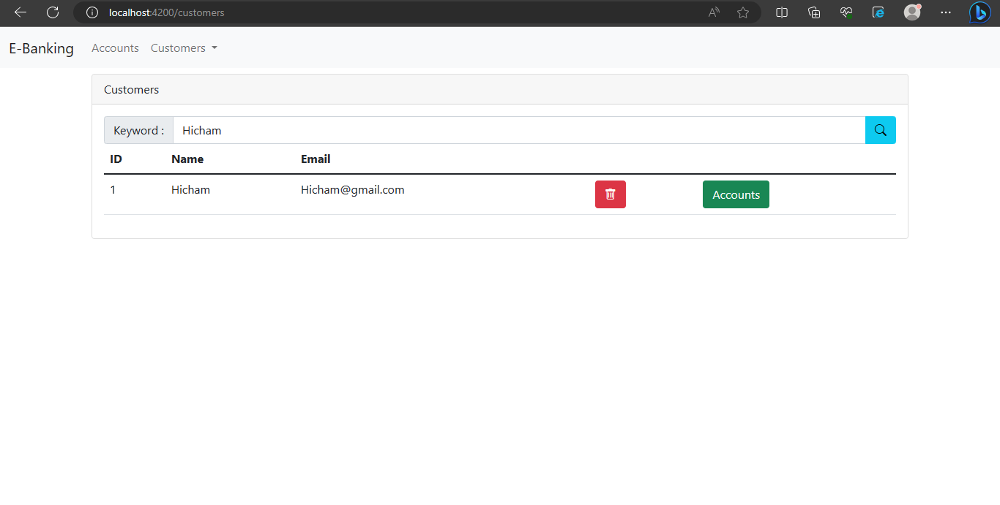

### Client Account
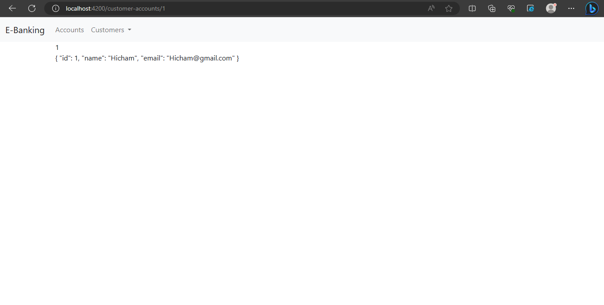

### Add Client
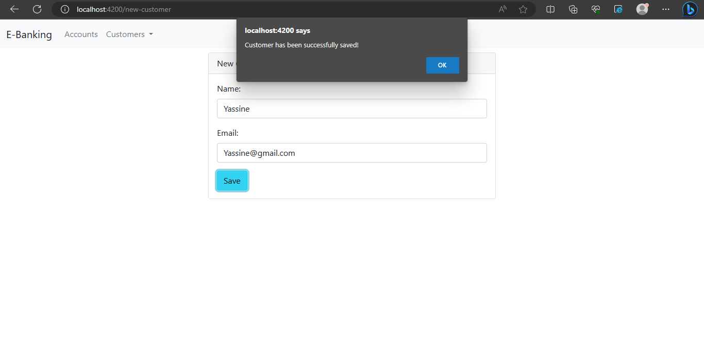

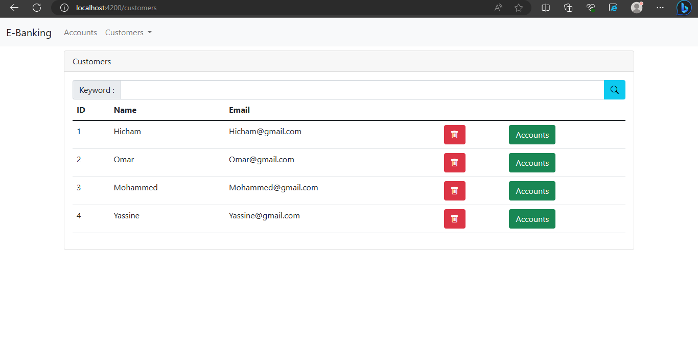

### Delete Client
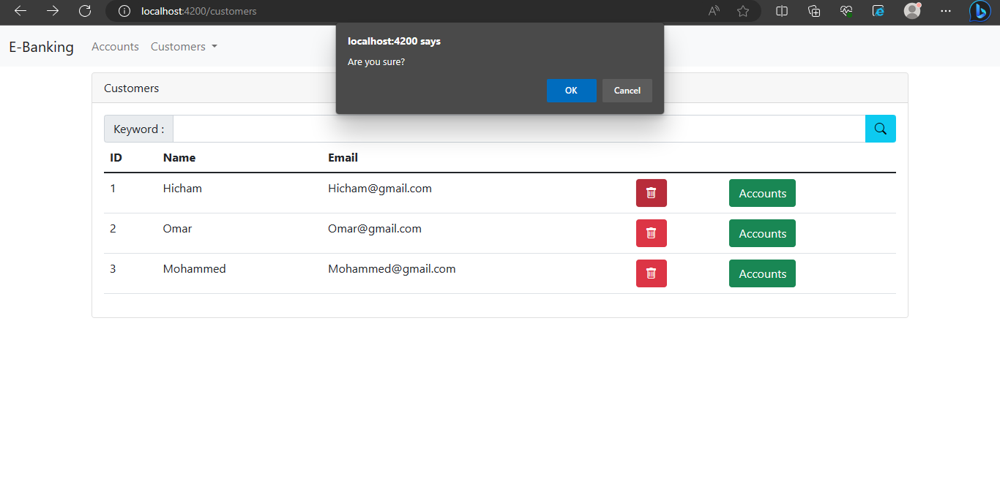

### Account Details
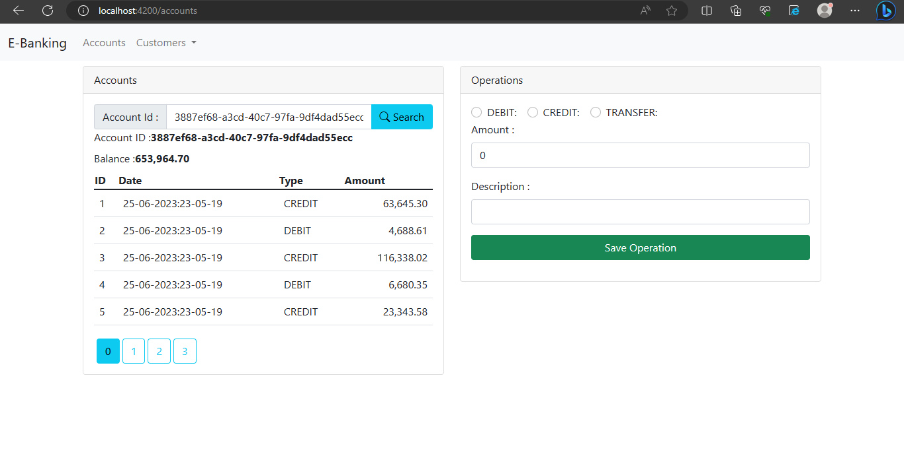

### Operation success
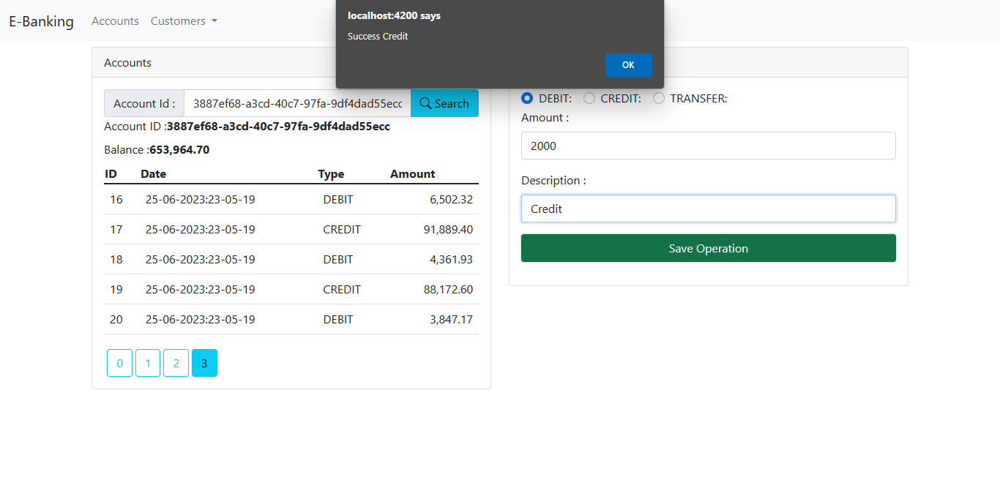

### Swagger Operations
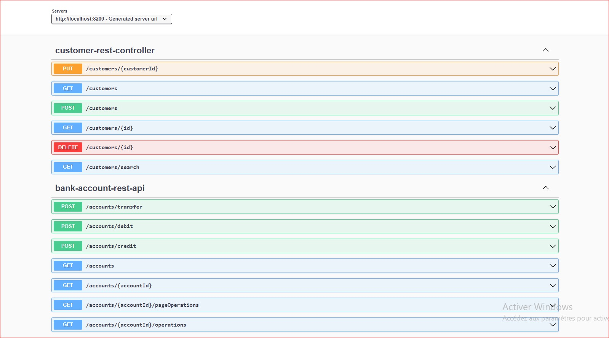

### Adding
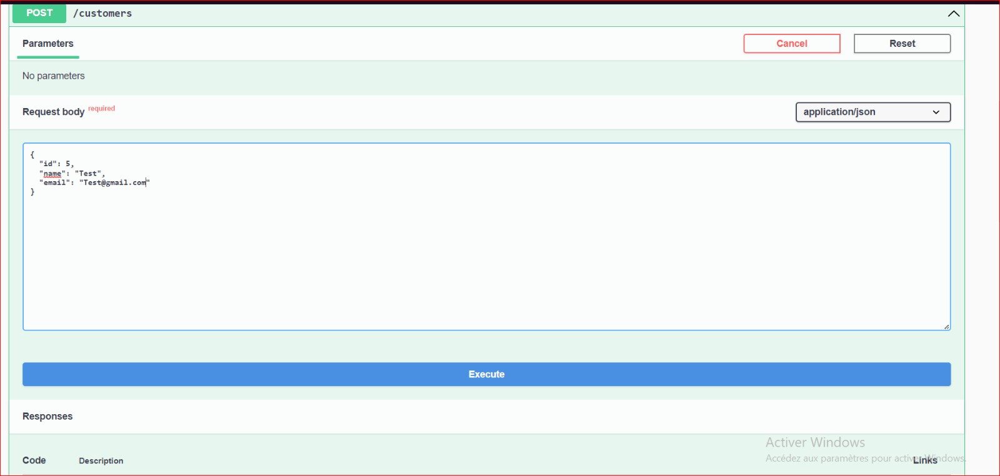

### Confirmation
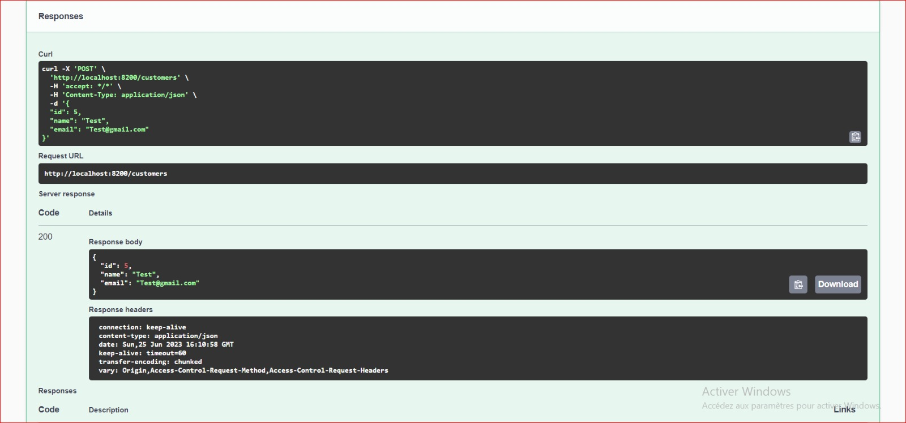

### Deleting
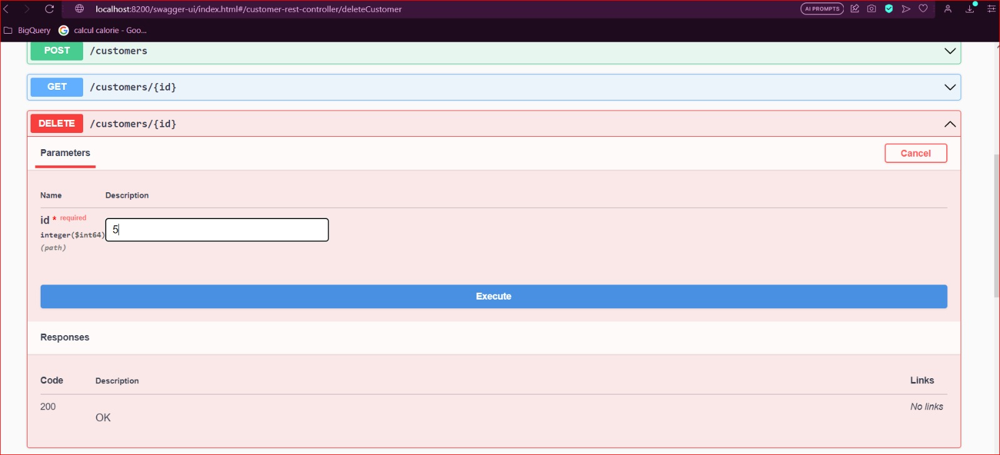
